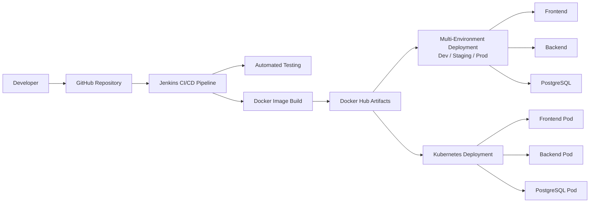

# DevOps Dashboard Architecture

```mermaid
flowchart LR
    A["Developer"] --> B["GitHub Repository"]
    B --> C["Jenkins CI/CD Pipeline"]

    C --> D["Automated Testing"]
    C --> E["Docker Image Build"]
    E --> F["Docker Hub Artifacts"]

    F --> G["Multi-Environment Deployment<br/>Dev / Staging / Prod"]
    G --> H["Frontend"]
    G --> I["Backend"]
    G --> J["PostgreSQL"]

    F --> K["Kubernetes Deployment"]
    K --> L["Frontend Pod"]
    K --> M["Backend Pod"]
    K --> N["PostgreSQL Pod"]
```
